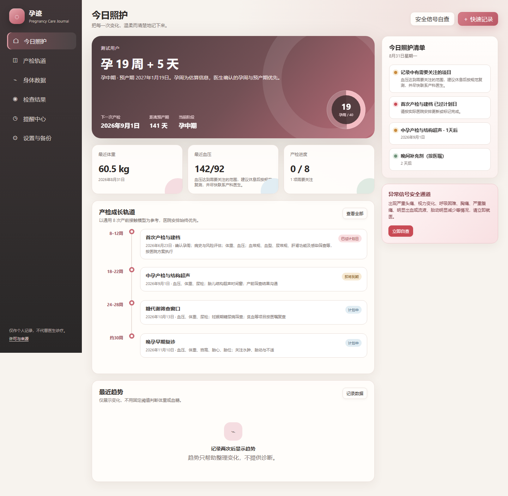
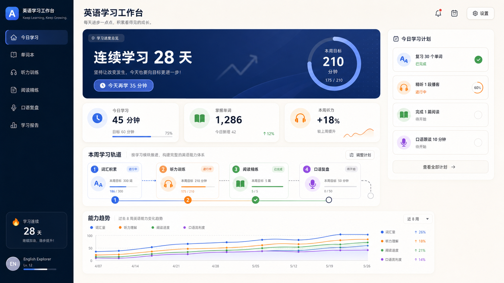
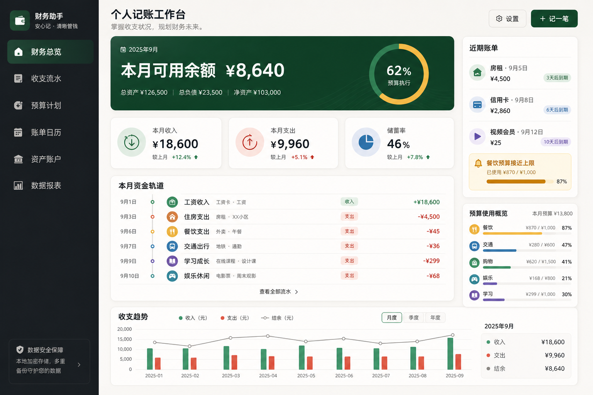
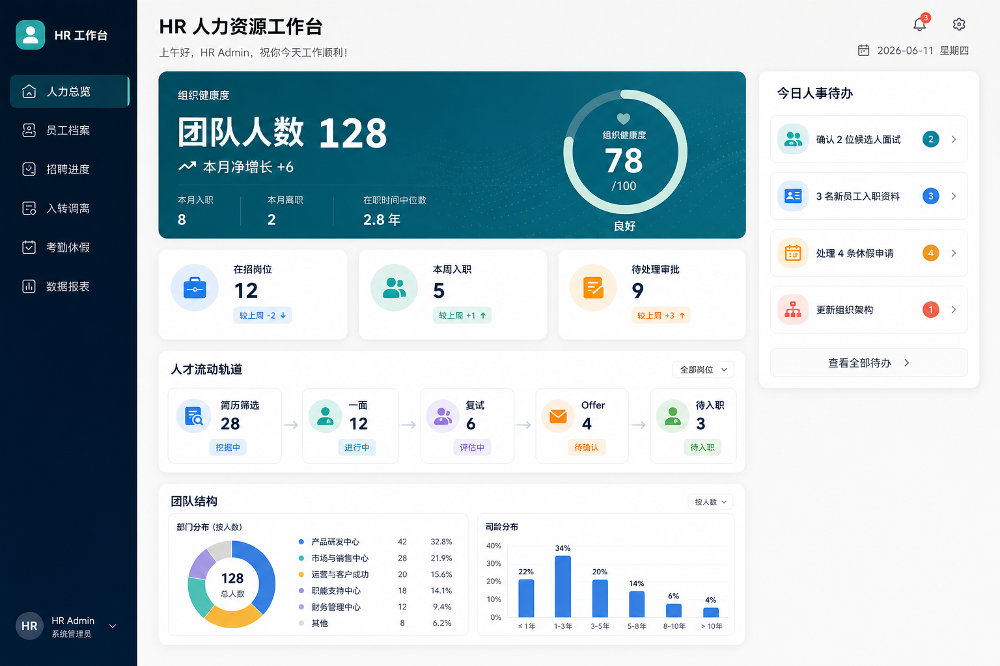
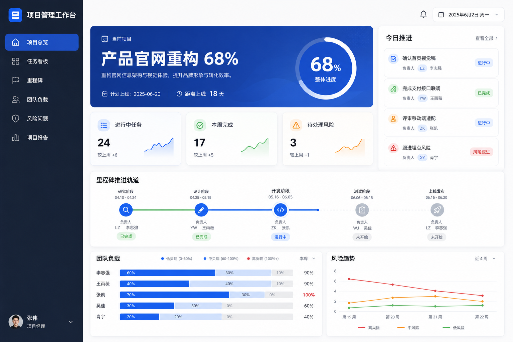

# workbench-architect

`workbench-architect` 是一个面向 Codex 的工作台需求与提示词架构 Skill。

它会先通过对话或用户资料还原真实工作流，输出工作台定义卡；内容确认后生成三套与业务适配、具有完整设计深度的界面方向供用户选择；最后生成可在当前平台执行或复制到其他 Agent 平台的自包含搭建提示词。


## 它能帮你做什么

你可以只提供一句模糊想法，也可以交给它一段对话、一份表格、参考截图或现有工作流程。它会把这些零散信息整理成真正可以实施的工作台方案：

- 找出目标用户、真实痛点和高频使用场景。
- 梳理核心工作流、数据对象、功能和自动联动。
- 先输出工作台定义卡，避免需求没想清楚就开始堆页面。
- 根据业务内容设计三套实质不同的精美界面方向，而不是只替换配色。
- 生成包含数据、交互、视觉、技术和验收标准的完整搭建提示词。
- 提示词可以复制到其他 Agent，也可以在当前平台继续直接搭建。
- 强制关注真实按钮、数据保存、导入导出、备份恢复和验收，避免做成只能看的展示页面。
- 自动盘点所有基础数据，为每一类设计批量导入和批量导出，而不是只处理一张核心表。
- 补全与业务匹配的系统配置，并生成可跨物理终端恢复的全工作台备份方案。

适合个人管理、内容创作、客户跟进、财务记账、教育管理，以及各种需要把重复工作集中起来的垂直业务场景。

## 工作台预览案例

下面展示同一套方法在不同业务中的界面方向。`孕迹` 是已经实际搭建并验证过的本地工作台，其余四张用于展示界面方案，不代表仓库中包含对应的可运行成品。

<table>
  <tr>
    <td width="50%"><strong>孕迹 · 孕期记录工作台</strong><br><sub>产检轨道、身体数据、检查结果、提醒和危险信号</sub><br></td>
    <td width="50%"><strong>英语学习工作台</strong><br><sub>学习计划、单词、听力、阅读、口语和能力趋势</sub><br></td>
  </tr>
  <tr>
    <td width="50%"><strong>个人记账工作台</strong><br><sub>收支流水、预算、账单、资产账户和财务趋势</sub><br></td>
    <td width="50%"><strong>HR 人力资源工作台</strong><br><sub>员工、招聘、入转调离、考勤和组织数据</sub><br></td>
  </tr>
</table>

<p><strong>项目管理工作台</strong><br><sub>任务、里程碑、风险、团队负载和项目报告</sub></p>



## 核心流程

1. 提炼目标用户、真实流程、痛点、数据和交付环境。
2. 确认第一版范围、核心闭环和不做事项。
3. 输出工作台定义卡并等待确认。
4. 根据业务内容生成三套实质不同的界面方向。
5. 用户选择或混合界面方案，形成视觉规范卡。
6. 输出数据可迁移矩阵、系统配置清单和跨终端备份恢复方案。
7. 生成包含数据、交互、视觉、技术和验收标准的搭建提示词。

## 数据可迁移底座

无论工作台主题是什么，最终方案都会把数据迁移能力作为基础要求：

- 逐项识别基础数据、业务记录、系统配置、关系历史和附件资源。
- 每一种基础数据都具备模板、批量导入、批量导出、去重、关联解析和错误报告。
- 完整备份覆盖所有模块、配置、关系、历史规则和实际附件。
- 备份可从物理终端 A 迁移到全新的终端 B，不依赖原电脑绝对路径或浏览器身份。
- 恢复前先预览并保护目标终端现有数据，失败时回滚，完成后核对数量、关系、配置和附件。

## 安装到 Codex

```powershell
python -X utf8 "$env:USERPROFILE\.codex\skills\.system\skill-installer\scripts\install-skill-from-github.py" `
  --repo dorlarosendo434-hub/workbench-architect `
  --path . `
  --name workbench-architect
```

安装后重新打开 Codex，或在下一轮对话中调用：

```text
使用 $workbench-architect，帮我梳理需要什么工作台并生成可直接搭建的提示词。
```

## 使用许可

本项目采用自定义的“个人创作者使用许可”。它不是允许商业化转售的开源许可证。

允许：

- 独立创作者免费使用本 Skill。
- 使用生成的工作台管理自己的内容创作、付费商单、收入和个人创作业务。
- 为个人学习、研究、教学或非营利目的修改和使用。
- 在完整保留许可声明的前提下免费分享或分发。

禁止：

- 出售、出租或收费授权本 Skill 或生成的工作台。
- 提供付费代搭建、白标交付、订阅、SaaS 或托管服务。
- 将其主要功能包装为收费产品、课程交付物或商业服务。
- 删除、隐藏或改写非商业化声明。

需要商业化转售或收费服务授权时，必须先取得版权所有者的单独书面许可。完整条款见 [LICENSE.md](LICENSE.md)。

## 文件结构

```text
workbench-architect/
├── SKILL.md
├── LICENSE.md
├── README.md
├── assets/
│   ├── workbench-architect-intro-16x9.png
│   └── showcases/
│       ├── pregnancy-care-workbench.png
│       ├── english-learning-workbench.png
│       ├── personal-finance-workbench.png
│       ├── hr-workbench.png
│       └── project-management-workbench.png
├── agents/
│   └── openai.yaml
└── references/
    ├── discovery.md
    ├── data-portability.md
    ├── delivery-options.md
    ├── prompt-blueprint.md
    └── visual-directions.md
```

## 免责声明

本项目按现状提供，不承诺适用于特定用途。许可声明用于明确作者的授权意图，不构成针对具体司法辖区或纠纷的法律意见。

## 关注与交流

欢迎关注公众号，获取工作台需求梳理、界面方案、搭建案例和 AI Skill 实操分享；也可以添加微信进群，交流工作台搭建与 AI 创作工作流。非诚勿扰。

添加微信时，请备注 **「AI交流」**。

<table>
  <tr>
    <td width="50%" align="center"><strong>添加微信</strong><br><sub>备注「AI交流」，进群交流工作流</sub><br></td>
    <td width="50%" align="center"><strong>关注公众号</strong><br><sub>获取工作台与 Skill 实操案例</sub><br></td>
  </tr>
</table>
